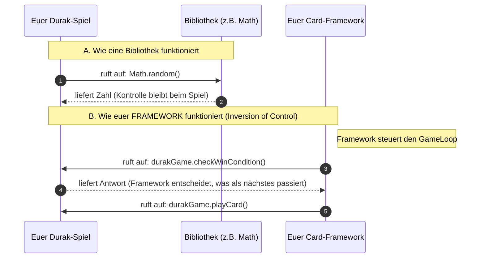

# Was am Ende existieren soll
- Wir schreiben ein Package mit dem Framework welches Allgemein Kartenspiele mit Skatkarten ermöglicht. 
- Enthält State-Pattern, Command-Undo, GameLoop etc.
- Im nächsten Schritt soll ein Showcase Durak existieren das dieses Framework nutzt und erweitert. 
	- Falls die Zeit knapp wird kann auch vereinfacht Maumau entwickelt werden 
- Ein Projektbericht von 15 (Text-)Seiten 
# Was soll das Framework machen
- Das Framework legt die Grundlage für Kartenspiele wie Durak, Maumau, Poker oder ähnliches
- Kennt die konkreten Spielregeln und Kartendecks
- Um das zu ermöglichen muss das Framework
	- Handkarten verwalten können
	- Züge und wer gerade dran ist verwalten können
	- Einen oder mehrere Stapel in der Mitte oder einen Tisch oder sowas
	- Karten mischen oder sowas anbieten
	- Verschiedene Kartendecks (also 32 oder 52 deck oder Exploding Kittens Karten)
- Das Framework bildet die Grundlage welche von dem Showcase genutzt und erweitert wird

# Was soll der Showcase machen
- Es soll ein Durak Spiel sein welches das Framework nutzt und erweitert
- Im Showcase müssen wir definieren wie ein Turn abläuft also aus welchen Phasen es besteht und welche Actions man in welcher Phase machen kann

# Visualisierung
- komplett ki-generierte grafische Oberfläche mit Java Swing weil das älter ist kaum dependecies wegen Java 11, Maven etc. 
### Prompt für später
Schreibe mir eine grafische Oberfläche für ein Kartenspiel in **reinem Standard Java Swing** (ohne Maven, ohne externe Abhängigkeiten, ohne WindowBuilder). Ich brauche ein `JFrame`, das in der Mitte eine Art Tisch darstellt (ein `JPanel`) und unten die Handkarten des Spielers (mehrere `JButton`s in einem FlowLayout). Trenne die reinen Anzeigeelemente von der Logik. Erzeuge keine komplexe Architektur, halte es in 1-2 Klassen so simpel wie möglich.
### Für die Doku
Für die Visualisierung des Showcase-Spiels (Durak) wurde eine minimalistische Java-Swing-Oberfläche implementiert. Da der Fokus dieser Arbeit auf der Architektur des Frameworks liegt, wurde der reine Boilerplate-Code für das Layout (Erstellung des JFrames, Platzierung der JButtons) durch Gemini 3.1 Pro generiert. Die Anbindung der generierten Oberflächen-Elemente an die Geschäftslogik (Event-Listener, Controller und das Aufrufen der entsprechenden Command-Pattern-Logik) wurde jedoch manuell und konform zum MVC-Pattern selbst entworfen und umgesetzt.
# Framework funktionsweise versus Bibliothek
